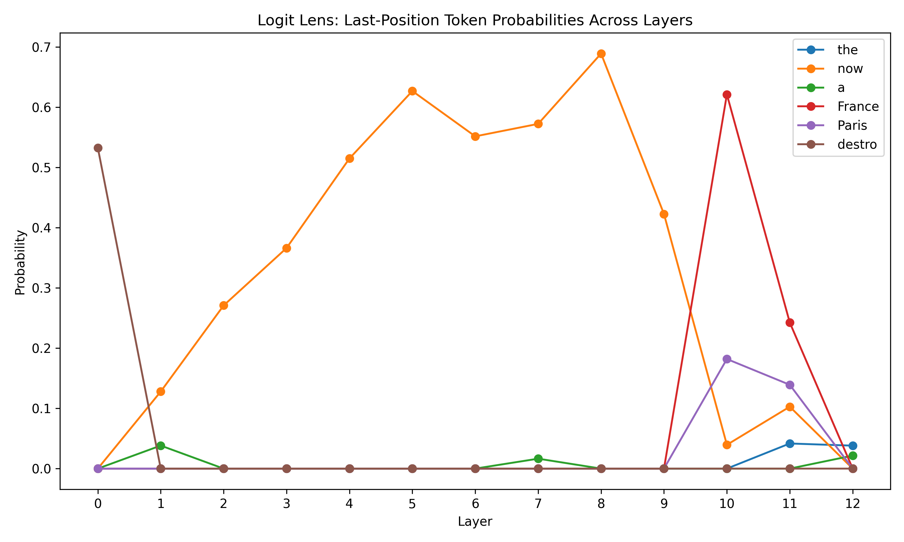
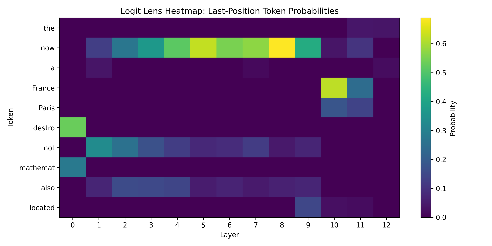
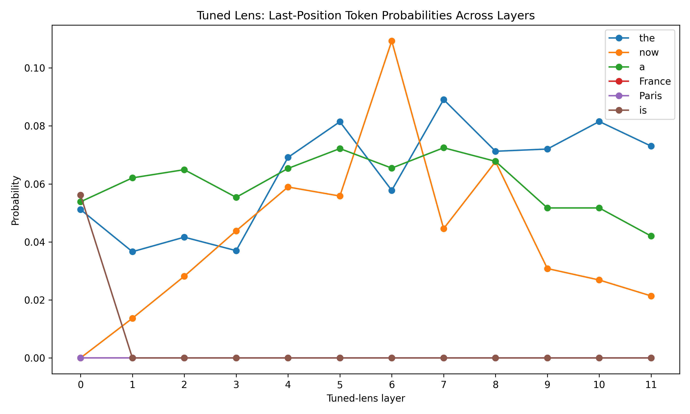
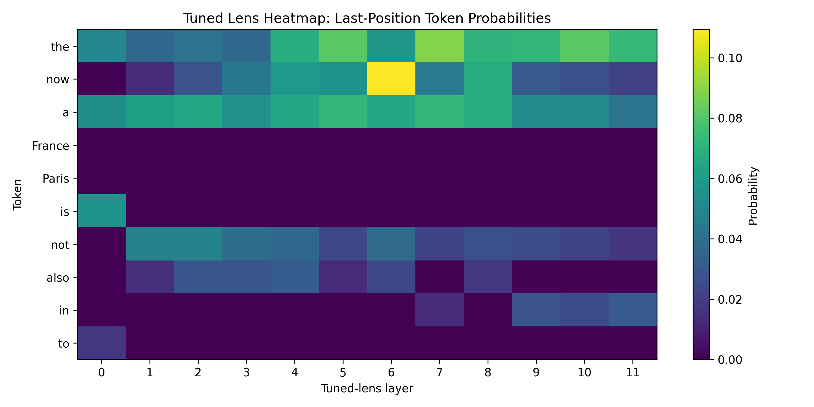

# Logit Lens vs. Tuned Lens

## Introduction

We evaluate our implementation of a logit lens and a tuned lens based on the prompt "The capital of France is" to see how the model, gpt-2, processes the prompt throughout its hidden layers to determine its response.

Both lenses are meant to understand the hidden layers of an LLM. A logit lens assumes every layer can be decoded using the final unembedding matrix, whereas a tuned lens passes each layer through a small trained linear map to decode that layer's token predictions. Usually, a tuned lens has a more accurate interpretation of the model's predictions at each layer.

Our implementation of both lenses give the model's top predictions for each position across all hidden layers of the model. The positions we see in both lenses correspond to the model's predicted next token. That is, in our prompt, Position 0 is "The", Position 1 is "capital", etc. In our lens, by contrast, Position 0 is the model's prediction for our prompt's Position 1, Position 1 is the prediction for our prompt's Position 2, etc. Thus, the lens' token that we are most interested in occurs at Position 4, and we would expect to see "Paris".

We find the tokens with the top 5 scores at each position in each layer for the logit lens and the tuned lens. We then compare the model's actual output distribution with the logit and tuned lens' final layer distribution.

(Note that Layer 12 in the logit lens is the final normalized residual stream after all layers, so the logit lens' final layer is Layer 11.)

## How to Run the Code

First, in the `logit-tuned-lenses` directory, run

```bash
uv sync
```

For logit lens, run

```bash
uv run python logit_lens.py \
  --model gpt2 \
  --prompt "The capital of France is" \
  --lineplot-output logit_lineplot.png \
  --heatmap-output logit_heatmap.png
```

For tuned lens, run

```bash
uv run python run_tuned_lens.py \
  --model gpt2 \
  --prompt "The capital of France is" \
  --lineplot-output tuned_lineplot.png \
  --heatmap-output tuned_heatmap.png
```

## Logit Lens Visualizations

### Line Plot


### Heatmap


## Tuned Lens Visualizations

### Line Plot


### Heatmap


## Results

### Logit Lens

We see that the word "Paris" appears meaningfully at Layer 10 with a score of 0.1819. In the final layer (Layer 11), "Paris" has a score of 0.1392. So, the logit lens recovers the correct answer signal. However, the word "France" has a higher score than "Paris" with a score of 0.6213 in Layer 10 and a score of 0.2424 in Layer 11. Thus, the word "Paris" only achieves the second-highest score in our logit lens.

It's important to note the occurrence of "specific" tokens compared to "general" tokens in our logit lens. Specific tokens refers to words like "France", "Paris", "London", or any particular name. General tokens refers to words like "the", "a", "is", or any common grammatical word. Consider Layer 10: combining the scores of "France" and "Paris" gives us a specific token score of roughly 0.8, a very high score for specific tokens.

Additionally, we note the uncertainty of our logit lens. We see in Layer 10, the top scores are ~0.62 and ~0.18, and the rest are small. The logit lens is highly confident in the likelihood of these two scores, or it gives a low uncertainty for these tokens.

Finally, we compare the logit lens for the final layer (Layer 11) with the actual model output distribution and observe that the logit lens was very far off from the actual model output:

| **Logit Lens** |  |  |  |
|----------------|--|--|--|
| Token (Layer 11) | Prob  | Token (Model) | Prob  |
|------------------|-------|---------------|-------|
| France           | 0.2424| the           | 0.0846|
| Paris            | 0.1392| now           | 0.0479|
| now              | 0.1028| a             | 0.0462|
| the              | 0.0417| France        | 0.0324|
| located          | 0.0230| Paris         | 0.0322|

### Tuned Lens

We see that the word "Paris" never appears in the top-5 tokens across any layer. The tuned lens actually fails to surface the expected token.

The tuned lens' Layer 10 top 5 tokens only contains generic tokens: "the", "a", "now", "in", "not". The scores for these top 5 tokens only reaches ~0.21, meaning the tuned lens observes the model being far more uncertain than what the logit lens had indicated.

Compare the tuned lens for the final layer (Layer 11) with the actual model output distribution and observe that the tuned lens is closer to the actual model output than the logit lens:

| **Tuned Lens** |  |  |  |
|----------------|--|--|--|
| Token (Layer 11) | Prob  | Token (Model) | Prob  |
|------------------|-------|---------------|-------|
| the              | 0.0730| the           | 0.0846|
| a                | 0.0420| now           | 0.0479|
| in               | 0.0314| a             | 0.0462|
| now              | 0.0214| France        | 0.0324|
| not              | 0.0164| Paris         | 0.0322|

## Conclusion

The logit lens better recovers the answer we would expect ("Paris"), while the tuned lens more accurately reproduces the model's actual output distribution (which favors generic tokens more than specific tokens). Each lens has its advantages and drawbacks, but neither perfectly modeled the LLM's true hidden layer behavior. 