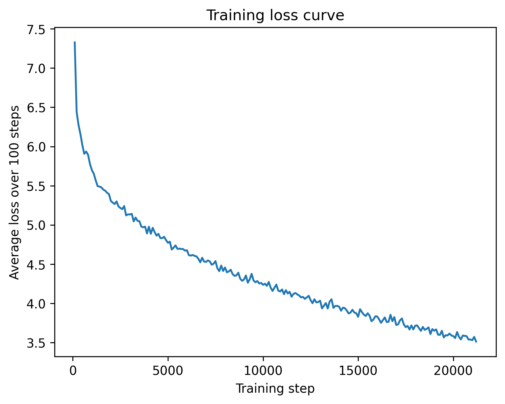

# Transformers From Scratch — Autoregressive LLMs

This project includes my contributions to a group project which can be found at
https://github.com/bguevel/LLM1.

I implemented the following in PyTorch:

- **Python files: `0/luca-gpt1.py` and `0/luca-gpt1-untrained.py`**
- **Jupyter notebooks: `luca-correct.ipynb` and `luca-gpt1-untrained.py`**
  - Single-head autoregressive Transformer
  - Trained on **Project Gutenberg — _Frankenstein_**
  - Includes a trained vs. untrained comparison

---

## Setup for Python scripts (uv)

From the **repo root** (the directory that contains `pyproject.toml`):

```bash
uv sync
```

Then run Python programs with:

```bash
uv run python <file>.py
```

### If `uv sync` fails
If `uv sync` fails due to a lockfile/environment issue, it may be related to the existing `uv.lock`.  
A common fix is to delete `uv.lock` and rerun:

```bash
rm uv.lock
uv sync
```

*(Only do this if `uv sync` is failing—otherwise keep the lockfile for reproducibility.)*

---

## Running the model


Run the **trained** single-head model:

```bash
uv run python luca-gpt1.py
```

Run the **untrained** single-head model (same architecture, random weights):

```bash
uv run python luca-gpt1-untrained.py
```

These script-style files print a short generation from a default prompt near the bottom of the file.

---

## Design choices

### Single-head attention
I chose **single-head self-attention** for the `luca-gpt1` model for a faster training time and a lower memory usage. This implementation was much simpler and straightforward compared to the multi-head self-attention, but the model only learns one type of attention pattern at a time. I found that the attention mechanism was the most challenging part to design, as the math behind the matrix multiplication was the most complex part of the transformer implementation.

---

## Example outputs (trained vs. untrained)


### Trained output (luca-gpt1)
**Prompt:** `why is the sky blue`

```
of the presence of his presence . begone , i should remain in agony and decisive . how was i engrossed much i am happy ,
 and my ship . never in the most grateful little air and illuminate his composure . he did his eyes , and i was carried
in the moment of my intellect . he could not prevail of what he had never down and wet branches . but when some airs ,
he showed signs
```

### Untrained output (luca-gpt1-untrained)
**Prompt:** `why is the sky blue`

```
impracticability pitchy betray turbulence feels purposes feel inexorable suspended colleges realities meed instigate
prized drunken leaf agonising tools impracticable nourishment wakefield your career tend tormenting slow reply hovered
aversion miracles questioned seeing undoubtedly their vast precipitate languor pleasant certainly shine sighed hatred
cruel released incurable directed confirm comfort pronounced skin interrupted arteries behold white arrested specked
families pursuits hear second brutality breezes render trickling thunderstorm figures majestic equals fancy deeper
down internal impossibilities equally cologne agitated creaking vengeance outstript therefore
```

---

## Training loss

The following plots show training loss for luca-gpt1 (one epoch):



